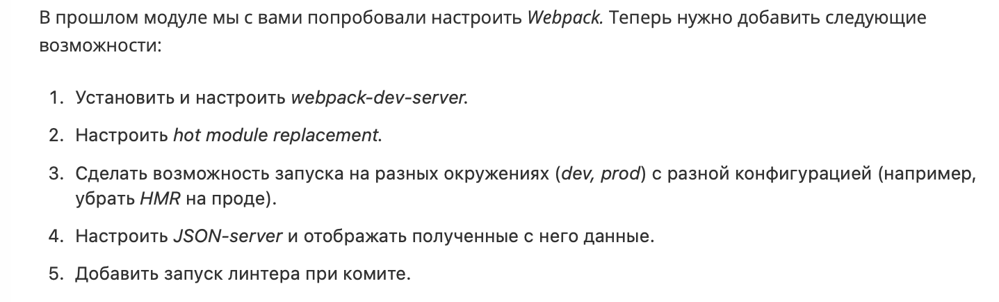

Привет, меня зовут **Алина** 👋

Учусь на курсе  

**Fullstack разработчик на Python**
 

Блок **Frontend-разработка**
# Building and pack project


[](https://git.io/typing-svg)

---

🏎️**Для запуска проекта:**

1.Клонируем [репозиторий](https://github.com/Nimalia/E13-SF-BuildingProject.git)

2.Установка зависимостей:
````bash
npm i
npm i --save-dev 
````

3.Development: 

конфигурация в ```webpack.config.js``

запуск 
````bash 
npm run start-dev
````
❗️port:3000 (http://localhost:3000/)

4.Production: 

конфигурация в ```webpack.config.prod.js``

запуск 
````bash 
npm run start-prod
npm install -g http-server
cd ../dist
http-server
````
❗️port:8080 (http://127.0.0.1:8080)

5.JSON-server

запуск:
````bash 
json-server --watch database.json
````
❗️port:3000 (http://localhost:3000/)


6.ESLint check commit
````bash 
git commit -a -m "description"
````

Также выполнение ESlint можно проверить командой:
```bash
npx eslint ./src/index.js 
```

___


**Задание:**



**Решения:**

➡️**NPM:**

Установить [NPM](https://nodejs.org/en/download) 

Если есть файл ````package.json````, то команды:
````bash 
npm install 
npm start
````
если нет, то:
````bash 
npm init
````
Установка/удаление пакетов:
````bash 
npm install <название_пакета>
npm uninstall <название_пакета>
````

➡️**WEBPACK:**

Для работы с Webpack нам в первую очередь необходимо установить два пакета (````webpack и webpack-cli````) с помощью команды:
````bash 
npm install webpack webpack-cli --save-dev
````

Пакет ````webpack-cli```` необходим нам для работы с вебпаком в командной строке

В ````package.json```` добавим в объект scripts:
````bash 
"build" : "webpack"
````

Запуск webpack
````bash 
npm run build.
````
Нужно создать конфигурационный файл ````webpack.config.js````
````bash 
module.exports :

module.exports = {
    entry: './src/index.js',
    output: {
        filename: 'main.js'
    }
}
````

➡️**Шаблониатор PUG:**
````bash 
npm install pug pug-loader --save-dev
````
Понадобится плагин ````HtmlWebpackPlugin````, который упрощает создание файлов HTML для обслуживания веб-пакетов.

webpack.config.js:
````bash 
module.exports = {
     entry: '/index.js',
     output: {
		filename: 'main.js'
	},
	plugins: [
		new HtmlWebpackPlugin({template: '/index.pug'})
	],
	module: {
		rules: [
				{
				test: /\.pug$/,
				loader: 'pug-loader',
				options: {
				pretty: true
				}
			}
		]
	}
};
````

➡️**JSLint:**

````bash 
npm install eslint --save-dev
npx eslint --init
npx eslint yourfile.js
````

Для удобства можно добавить этот скрипт в package.json, чтобы в дальнейшем пользоваться npm run lint.

После запуска у eslint --init в вашем каталоге появится файл .eslintrc.js. В нем вы увидите некоторые правила, настроенные следующим образом:
````bash 
{
	"rules": {
		"semi": ["error", "always"],
		"quotes": ["error", "double"]
	}
}
````

➡️**Dev server:**

В поле ````mode```` в ````webpack.config.js```` значение ````development````. Конфигурация будет использована только в режиме разработки.

Установка: 
````bash
npm install --save-dev webpack-dev-server
````
Для того, чтобы сервер знал, где искать файлы, нужно изменить webpack.config.js:
````bash
module.exports = {
    mode: 'development',
    entry: './src/index.js',
   devServer: {
     static: './dist',
   },
    plugins: [
           new HtmlWebpackPlugin({
        title: 'Development',
      }),
    ],
    output: {
      filename: 'main.js',
    },
  };

  devServer: {
     static: './dist',
     port: 3001
   },

  stats: {
    children: false
}
````

➡️**Source map:**
 
В ```webpack.config.js``` добавим: 
````bash
devtool: 'inline-source-map',
````


Webpack-dev-server поддерживает hot режим, а значит мы можем подключить HMR.
````bash
devServer: {
     contentBase: './dist',
     hot: true,
   },
````

➡️**Prod- и dev-окружения:**

Dev у меня в ```webpack.config.js```

для Prod нужно создать ```webpack.config.prod.js```
обязательно поменять:
````bash
mode: 'production',
````
Для сборки приложения в production:
````bash
webpack --config webpack.config.prod.js
````
Для сборки приложения в development:
````bash
webpack --config webpack.config.js
````


➡️**JSON-server:**

Установка
````bash 
npm install -g json-server
````
Чтобы настроить и запустить JSON-сервер нужно создать файл в формате  JSON с данными. Назвать его можно database.json, или как вам удобнее.
Запуск JSON-сервера
````bash 
json-server --watch database.json
````

➡️**Husky:**

Установка: 
````bash 
npm install husky --save-dev
````
В разделе scripts ```package.json``` добавить:
````bash 
"scripts": {
  "lint": "eslint src"
}
````
Также в ```package.json``` добавить:
````bash 
"husky": {
  "hooks": {
    "pre-commit": "npm run lint"
  }
}

````
Создаем ```.eslintrc.js```

```bash
module.exports = {
    "env": {
        "browser": true,
        "es2021": true
    },
    "extends": "eslint:recommended",
    "overrides": [
        {
            "env": {
                "node": true
            },
            "files": [
                ".eslintrc.{js,cjs}"
            ],
            "parserOptions": {
                "sourceType": "script"
            }
        }
    ],
    "parserOptions": {
        "ecmaVersion": "latest",
        "sourceType": "module"
    },
    "rules": {
        "semi": ["error", "always"],
		"quotes": ["error", "double"]
    }
}

```

----
```` Спасибо за уделенное время! 🙏 ````

___


[](https://github.com/anuraghazra/github-readme-stats)